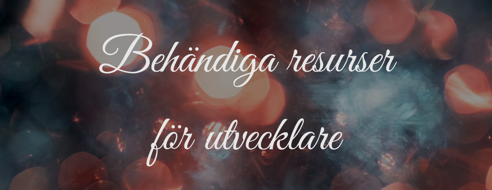

 

## Innehåll

 

- UI/UX Verktyg
- Fonter
- Bildredigerare
- Videoredigerare
- Ljud
- Färger
- Chrome extensions
- Visual Studio Code Extensions
- Atom Packages
- Unity Assets

 

## UI/UX Verktyg

Nedan finns det verktyg för UI/UX. Vissa är helt gratis, andra är gratis för en viss tid eller
för en viss mängd t.ex. för ett projekt.

 

|                            Länk                            | Beskrivning                                                                          |
| :--------------------------------------------------------: | :----------------------------------------------------------------------------------- |
|   [Adobe XD](https://www.adobe.com/fi/products/xd.html)    | En vektor baserad UX design verktyg för applikationer av Adobe                       |
|     [Figma](https://www.adobe.com/fi/products/xd.html)     | Är en webbläsare baserad UI och UX design applikation                                |
| [Mockplus](https://www.mockplus.com/free-wireframing-tool) | Allt i en design plattform för prototyping och skapning av design system             |
|   [InVision Studio](https://www.invisionapp.com/studio)    | En produkt design platform                                                           |
|              [Axure](https://www.axure.com/)               | En mjukvara för skapa prototyper och specifikationer för websidor                    |
|           [Wireframe.cc](https://wireframe.cc/)            | En molnbaserad lösning, var man kan skapa websidors och applikationers wireframes    |
|          [UI Sources](https://www.uisources.com/)          | En av största repositoryn av mobil design mönster. Här kan man få design inspiration |
|        [Pencil Project](https://pencil.evolus.vn/)         | En open source GUI prototyp verkytg som är tillgänglig för alla platformer           |

 

## Fonter

Alla fonter här är gratis och det finns flera som man också kan ha för komersiell användning.

|                      Länk                      | Beskrivning                                                                                |
| :--------------------------------------------: | :----------------------------------------------------------------------------------------- |
| [Font Squirell](https://www.fontsquirrel.com/) | En pålitlig sida, varifrån du kan ladda ner gratis högkvalitets fonter.                    |
| [Google Fonts](https://www.fontsquirrel.com/)  | Innehåller över 800 font familjer av olika typer                                           |
|      [Behance](https://www.behance.net/)       | En sida var människor kan visa sitt kreativa arbete. Här kan man hitta fina gratis fonter. |
|   [Neogrey](https://www.neogrey.com/fonts/)    | Portfolio av Ivan Filipov. Hans fonter får man ladda ner gratis                            |
|    [Font Space](https://www.fontspace.com/)    | Innehåller över 32,000 gratis fonter                                                       |
|       [Font Zone](https://fontzone.net/)       | Här finns över 1000 fonter av flera designare från hela världen                            |
|       [DaFont](https://www.dafont.com/)        | Ett arkiv av fonter som man får gratis ladda ner                                           |
|    [FontLibrary](https://fontlibrary.org/)     | Fonter som är gratis och lätta att lägga till sin sida                                     |

 

## Bildredigerare

Nedan finns det olika typer av bildredigerare. Alla av dem är inte endast för bildredigering.
Inkscape och Krita har också andra funktionaliteter.

 

|                                    Länk                                    | Beskrivning                                                                  |
| :------------------------------------------------------------------------: | :--------------------------------------------------------------------------- |
|                       [GIMP](https://www.gimp.org/)                        | En open source multiplattorm bildredigerare med nyttiga verktyg              |
|              [Paint.NET](https://www.getpaint.net/index.html)              | En genomtänkt fotoredigerings programvara, som är lätt att använda           |
|                        [Pixlr](https://pixlr.com/)                         | En online bilredigerare med verktyg för grafisk design                       |
|                      [PicsArt](https://picsart.com/)                       | En online video och bildredigerare med mångsidiga filtrar                    |
| [Photoshop Express](https://www.adobe.com/products/photoshop-express.html) | En online video och bildredigerare med mångsidiga filtrar                    |
|                     [Inkscape](https://inkscape.org/)                      | En kvalitets vektor grafiks programvara som kör på flera operativsystem      |
|                       [Krita](https://krita.org/en/)                       | Är en gratis open source målar program, som har flera nyttiga konst verktyg. |
|           [inPixio](https://www.inpixio.com/free-photo-editor/)            | En behändig fotoredigerare för Windows.                                      |

 

## Videoredigerare

Här finns det videoredigerare som du kan ha nytta av.

|                                                       Länk                                                       | Beskrivning                                                                   |
| :--------------------------------------------------------------------------------------------------------------: | :---------------------------------------------------------------------------- |
|                 [Davinci Resolve](https://www.blackmagicdesign.com/uk/products/davinciresolve/)                  | En elegant videoredigerings verktyg med ett modernt gränssnitt                |
|                        [VideoPad](https://www.nchsoftware.com/videopad/screenshots.html)                         | Nyttig videoredigerare för nybörjare                                          |
|                      [VSDC Free Video Editor](http://www.videosoftdev.com/video-editor-pro)                      | Videoredigerare för Windows                                                   |
|                                       [Blender](https://www.blender.org/)                                        | Gratis open source creation suite, som kan användas också för video editering |
| [Movie Maker 10](https://www.microsoft.com/en-us/p/movie-maker-10-free/9mvfq4lmz6c9?activetab=pivot:overviewtab) | Bra videoediterings program för snabba redigeringar av korta videon           |
|                                       [Lightworks](https://www.lwks.com/)                                        | En underbar redigerings system för att redigera videon                        |
|                  [Filmora](https://influencermarketinghub.com/video-editing-software/filmora/)                   | Bra videredigerings verktyg med flera funktioner                              |
|                                  [Avidemux](http://fixounet.free.fr/avidemux/)                                   | En lätt användbar videoredigerings verktyg                                    |

 

## Ljud

Här finns det olika slags ljudredigerare som kan vara nyttiga för dig. Alla av det här är gratis.

 

|                        Länk                         | Beskrivning                                                                |
| :-------------------------------------------------: | :------------------------------------------------------------------------- |
|      [Audacity](https://www.audacityteam.org/)      | En lätt användbar open-source flerspårs ljudredigerare                     |
|       [Ocenaudio](https://www.ocenaudio.com/)       | En audio editor för flera platformer, snabb och lätt att använda           |
|        [Wavosaur](https://www.wavosaur.com/)        | Gratis ljud editor för windows med VST plugins stöd.                       |
|      [Audio Cutter](https://audiotrimmer.com/)      | Ett online verktyg var du kan trimma eller klippa vilken ljudfil som helst |
|      [Traverso-daw](https://traverso-daw.org/)      | Gratis ljud redigerare för windows med VST plugins stöd.                   |
|       [Audiotool](https://www.audiotool.com/)       | En gratis online ljud editor var du kan göra dina egna sångar              |
|         [Audiomass](https://audiomass.co/)          | En komplett webbaserad ljudredigerare                                      |
| [Free Audio Editor](https://free-audio-editor.com/) | En profesionell ljudredigerare för alla platformer.                        |

 

## Färger

Nedan finns det flera olika slags verktyg som är nyttiga för bland annat att hitta de färger man vill
ha när man till exempel designar något.

 

|                              Länk                              | Beskrivning                                                                      |
| :------------------------------------------------------------: | :------------------------------------------------------------------------------- |
|               [Coolors.co](https://coolors.co/)                | Generera eller sök efter fina färgkombinationer för dina designer                |
|          [EggRadients](https://www.eggradients.com/)           | Gradient färg paletter med över 200+ gradienta bakgrundsfärger                   |
|              [HueSnap](https://www.huesnap.com/)               | Här kan du få info om färger, göra paletter och dela dem med andra               |
| [Color Calculator](https://www.sessions.edu/color-calculator/) | Välj en färg och harmoni för att få en rekommenderat färgschema                  |
|         [Color Supply](https://colorsupplyyy.com/app/)         | Hjälper dig att genererea och välja unika färgpaletter för sin sida              |
|              [Color Hunt](https://colorhunt.co/)               | Färgpalets verktyg för att få färgkombinations inspiration                       |
|     [Design Inspiration](https://www.designspiration.com/)     | Ett färg och bild verktyg för att tillverka moodboards                           |
|                  [Khroma](http://khroma.co/)                   | Lättaste vägen för dig att hitta och spara färgkombon och paletter som du gillar |

 

## Chrome Extensions

Chromes extensions är små program som man kan installera för att ändra på webbläsarens funktionalitet.
Chrome har flera nyttiga extensions, som kan underlätta och göra din upplevelse behagligare.

 

|                                                                        Länk                                                                        | Beskrivning                                                                                           |
| :------------------------------------------------------------------------------------------------------------------------------------------------: | :---------------------------------------------------------------------------------------------------- |
|                     [uBlock Origin](https://chrome.google.com/webstore/detail/ublock-origin/cjpalhdlnbpafiamejdnhcphjbkeiagm)                      | En effektiv reklam blockare                                                                           |
| [Awesome ScreenShot & Screen Recorder](https://chrome.google.com/webstore/detail/awesome-screenshot-screen/nlipoenfbbikpbjkfpfillcgkoblgpmj?hl=en) | Med den här extensionen kan du ta skärmdumpar och ta video av din skärm. Det går lätt att mellan dem. |
|                       [Clear Cache](https://chrome.google.com/webstore/detail/clear-cache/cppjkneekbjaeellbfkmgnhonkkjfpdn)                        | Tömmer din cache i din webbläsare med en klick                                                        |
|                                                  [ColorZilla](https://www.colorzilla.com/chrome/)                                                  | Hjälper dig med färg relaterade uppgifter                                                             |
|                     [CSS Viewer](https://chrome.google.com/webstore/detail/cssviewer/ggfgijbpiheegefliciemofobhmofgce?hl=en/)                      | Med CSS viewer kan du kolla på en websidas css                                                        |
|                          [WhatFont](https://chrome.google.com/webstore/detail/whatfont/jabopobgcpjmedljpbcaablpmlmfcogm)                           | Hjälper dig att identifiera fonter på en webbsida                                                     |
|                         [Sitemod.io](https://chrome.google.com/webstore/detail/sitemodio/efjbaneaebkanjmhengnedpllfdiocin)                         | Låter di modifiera en websida utan att ha tillgång till källkoden.                                    |
|                        [Wappalyzer](https://chrome.google.com/webstore/detail/wappalyzer/gppongmhjkpfnbhagpmjfkannfbllamg)                         | En extension som visar vad olika sidor är byggda med. Bland annat vilket CMS sidan använder.          |

 

## Visual Studio Code Extensions

Extensions i Visual Studio Code är tillägg som låter dig att finjustera och göra din upplevelse i VSCode bättre.Du kan installera Visual Studio Codes extensioner inne i Visual Studio Code.

 

|                                                        Länk                                                        | Beskrivning                                                                                       |
| :----------------------------------------------------------------------------------------------------------------: | :------------------------------------------------------------------------------------------------ |
|               [Prettier](https://marketplace.visualstudio.com/items?itemName=esbenp.prettier-vscode)               | Gör så att koden ser snyggare ut, och att du har det lättare att förstå din kod.                  |
|         [Project Manager](https://marketplace.visualstudio.com/items?itemName=alefragnani.project-manager)         | Gör det lättare för dig för att emellan dina projekt                                              |
|              [Live Server](https://marketplace.visualstudio.com/items?itemName=ritwickdey.LiveServer)              | Gör en server i bakgrunden för dig, som refreshar webbläsaren varje gång du sparar din fil        |
|       [JavaScript Snippets](https://marketplace.visualstudio.com/items?itemName=xabikos.JavaScriptSnippets)        | Ger åt dig flera nyttiga JavaScript utdrag                                                        |
| [Bracket Pair Colorizer 2](https://marketplace.visualstudio.com/items?itemName=CoenraadS.bracket-pair-colorizer-2) | Ger färg åt dina klammrar, vilket gör det lättare för dig att identifiera vilka klammrar hör ihop |
|              [CSS Peek](https://marketplace.visualstudio.com/items?itemName=pranaygp.vscode-css-peek)              | Gör det lättare för dig för att komma till den css, som du vill komma till                        |
|        [Material Theme](https://marketplace.visualstudio.com/items?itemName=Equinusocio.vsc-material-theme)        | Ger åt dig flera olika teman, som du kan välja emellan                                            |

 

## Atom Packages

Atom paket lägger till extra funktioner för huvudprodukten. För att installera paket i atom skall man fara till edit > prefrences > install och sedan söka efter det paketet man vill ha.

 

|                               Länk                                | Beskrivning                                                                    |
| :---------------------------------------------------------------: | :----------------------------------------------------------------------------- |
|              [Emmet](https://atom.io/packages/emmet)              | Har de nyttigaste verktygen för utvecklare                                     |
|      [Atom Beautify](https://atom.io/packages/atom-beautify)      | Städar din kod och gör den mera läsbar                                         |
|           [Git Plus](https://atom.io/packages/git-plus)           | Innehåller genvägar för de vanligaste git kommandona                           |
| [Highlight Selected](https://atom.io/packages/highlight-selected) | Markerar ord som du har dubbelklickat                                          |
|         [File Icons](https://atom.io/packages/file-icons)         | Sätter specifika ikoner brevid din fil                                         |
|           [Pigments](https://atom.io/packages/pigments)           | Visar färger i filar. Särskilt nyttig om man vill se vilken färg en hexkod har |
|             [Linter](https://atom.io/packages/linter)             | Analyserar din kod för möjliga fel                                             |
|       [Color Picker](https://atom.io/packages/color-picker)       | Låter dig välja färger i atom                                                  |

 

## Unity assets

Unity asset store har flera nyttiga verktyg, men det finns också utanför den flera verktyg som
man kan använda till Unity.
 

|                                                           Länk                                                            | Beskrivning                                                                    |
| :-----------------------------------------------------------------------------------------------------------------------: | :----------------------------------------------------------------------------- |
|                                            [Tiled](https://www.mapeditor.org/)                                            | Gratis lättanvänbar tile map editor                                            |
|                     [Cinemachine](https://unity.com/unity/features/editor/art-and-design/cinemachine)                     | Ett bra kamerakontrol system för unity                                         |
|  [Scene Manager Utility](https://assetstore.unity.com/packages/tools/utilities/scene-manager-utility-110261#description)  | Gör scenhanteringen i Unity lättare                                            |
|                                   [First Person All In One](https://www.mapeditor.org/)                                   | Förstapersons kontrolerare för Unity, som erbjuder flera anpassningsalternativ |
|   [Unity Particle Pack](https://assetstore.unity.com/packages/essentials/tutorial-projects/unity-particle-pack-127325)    | En samling av partikel tillgångar                                              |
| [Mesh Baker Free](https://assetstore.unity.com/packages/tools/modeling/mesh-baker-free-31895?aid=1101lSqC&utm_source=aff) | Den här kombinerar meshes och texturer för att minska dragandrop               |
|                                    [Canva](https://www.canva.com/colors/color-wheel/)                                     | Ett färghjul och en palette generator                                          |
|       [Spawner Free](https://assetstore.unity.com/packages/tools/ai/spawner-free-2704?aid=1101lSqC&utm_source=aff)        | Ett enkelt spawner system för Unity                                            |

 
